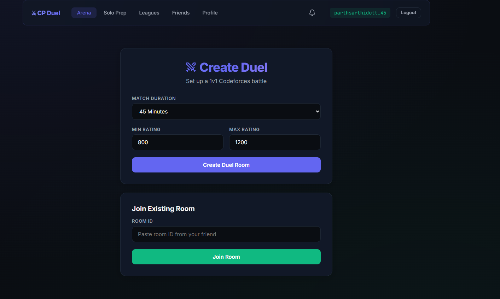
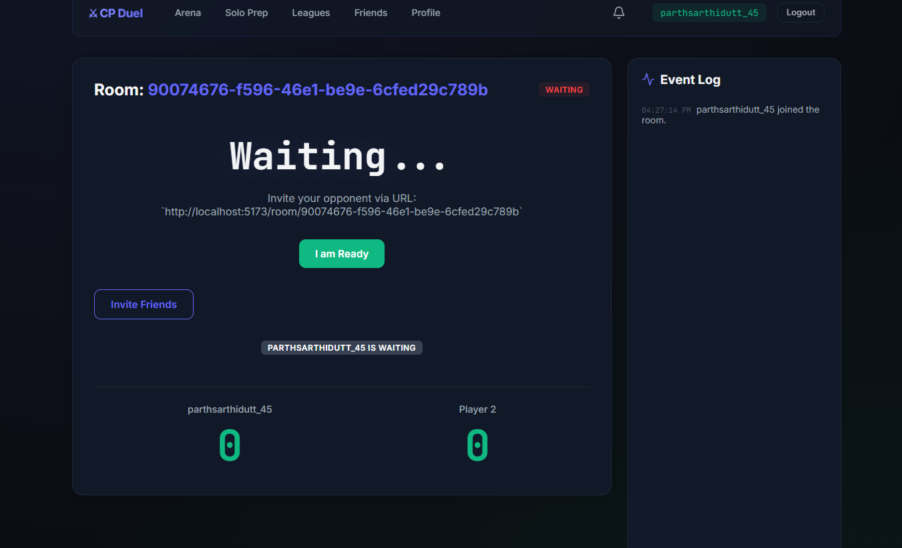
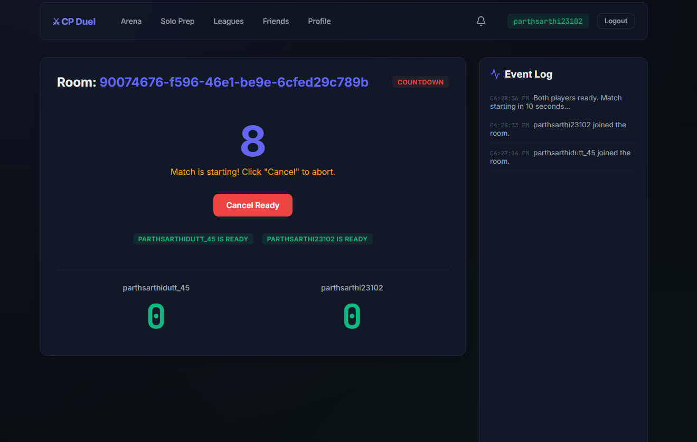
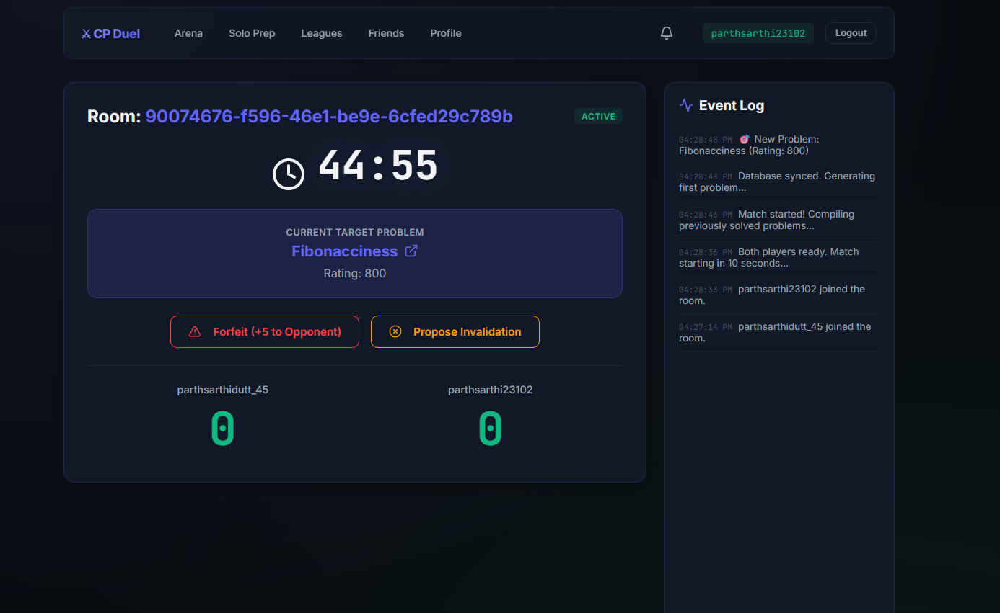
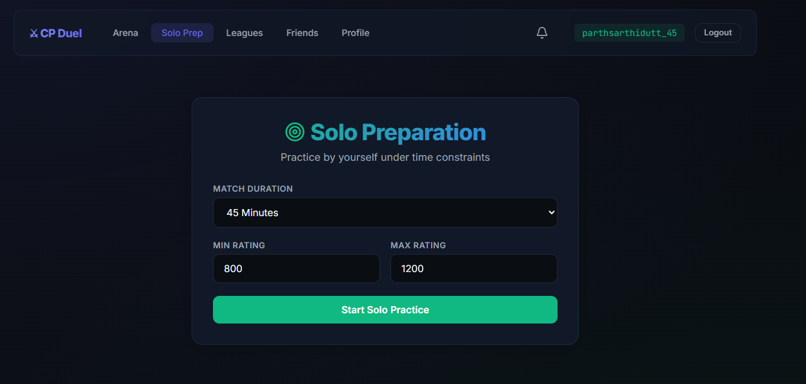
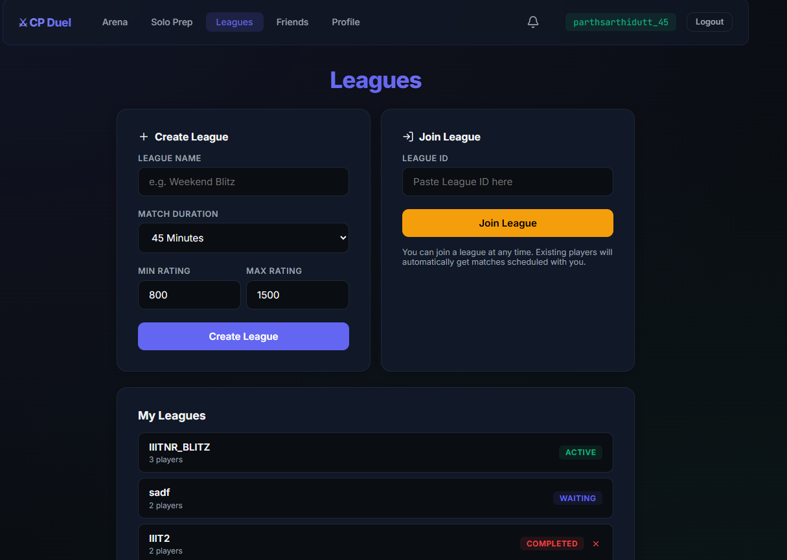
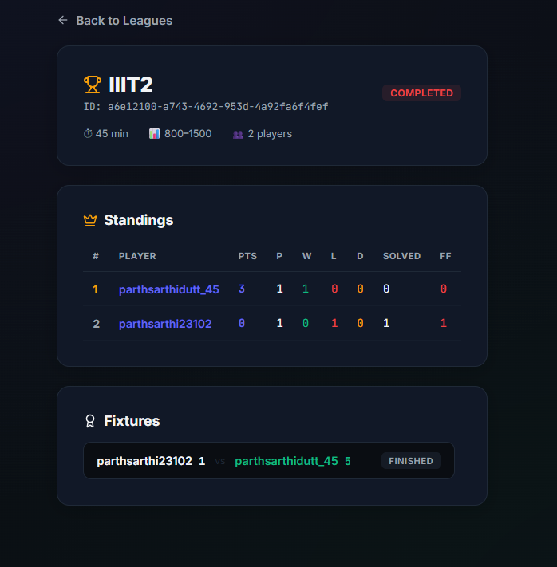
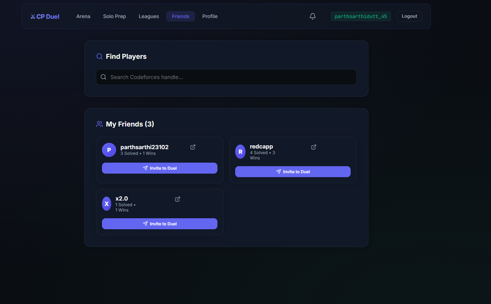
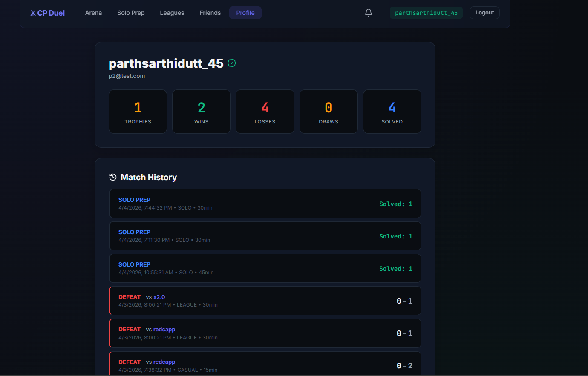

<div align="center">

# ⚔ CP Duel

### The Ultimate Real-Time Competitive Programming Arena

[](https://nodejs.org/)
[](https://reactjs.org/)
[](https://www.postgresql.org/)
[](https://socket.io/)
[](https://vitejs.dev/)
[](https://www.cloudflare.com/)
[](https://opensource.org/licenses/MIT)

**Challenge friends to real-time 1v1 Codeforces duels, compete in round-robin leagues, and grind solo — all from a single, sleek platform.**

[Getting Started](#-getting-started) · [Features](#-features) · [Screenshots](#-screenshots) · [Deploy Publicly](#-deploying-publicly-with-cloudflare-tunnel) · [Architecture](#-architecture) · [Contributing](#-contributing)

</div>

---

## 📸 Screenshots

<div align="center">

### Arena — Create & Join Duels


### Live Duel — Waiting for Opponent


### Live Duel — Countdown


### Live Duel — Active Match


### Solo Preparation


### Leagues — Create & Manage Tournaments


### League Detail — Standings & Fixtures


### Friends & Social


### Player Profile & Match History


</div>

---

## ✨ Features

### 🏟 Arena (1v1 Duels)
- **Real-time 1v1 battles** — Create a room, share the link, and duel head-to-head on random Codeforces problems.
- **WebSocket-driven** — Instant updates on problem solving, forfeits, ready status, and match results. No polling, no lag.
- **Configurable difficulty** — Set match duration (15–60 min) and Codeforces rating range (800–3500) to tailor the challenge.
- **Ready-up system** — Both players must ready-up before the 10-second countdown begins.
- **Live Event Log** — Every match event (joins, readies, new problems, solves) is timestamped and displayed in real-time.
- **Forfeit & Invalidation** — Forfeit if you need to leave (opponent gets +5 points), or propose mutual invalidation if something goes wrong.

### 🏆 Leagues & Tournaments
- **Round-Robin format** — Create private leagues with custom names, duration, and rating ranges. Every player plays every other player.
- **Live Standings table** — Points, wins, losses, draws, problems solved, and forfeits — all updated in real-time.
- **Mid-tournament joins** — Invite friends even after a league has started; the system automatically schedules catch-up matches against all existing players.
- **Automated match scheduling** — League fixtures are auto-generated. Click any fixture to jump straight into the duel room.
- **League lifecycle** — Leagues transition through `WAITING → ACTIVE → COMPLETED` states automatically.

### 🧠 Solo Prep
- **Focused practice** — All the intensity of a duel, but it's just you and the clock.
- **Same configuration** — Choose duration and rating range, solve problems under pressure.
- **Separate tracking** — Solo sessions are tracked independently from your 1v1 record.

### 🤝 Social & Notifications
- **Friends system** — Search by Codeforces handle, send/accept friend requests.
- **Instant invites** — Invite friends directly to your Arena rooms or League tournaments via real-time notifications.
- **Bell notifications** — Global notification bell shows pending invitations with accept/decline actions.
- **One-click duels** — Hit "Invite to Duel" on any friend's card to create a room and send them a notification instantly.

### 👤 Player Profiles
- **Public profiles** — View any player's stats: trophies, wins, losses, draws, and total problems solved.
- **Complete match history** — Every match logged with opponent, type (CASUAL/LEAGUE/SOLO), date, duration, and score.
- **Codeforces verification** — Link and verify your Codeforces handle via a bio-based token system.
- **Head-to-head links** — Click any opponent's name in match history to visit their profile.

### 🔐 Authentication
- **Google OAuth 2.0** — Sign in securely with your Google account.
- **JWT sessions** — Stateless, secure token-based authentication for all API requests.
- **Codeforces handle verification** — Paste a unique token into your Codeforces bio to prove account ownership.

---

## 🛠 Tech Stack

| Layer | Technology | Purpose |
|-------|-----------|---------|
| **Frontend** | React 19, Vite 8, React Router 7 | SPA with client-side routing |
| **UI** | Custom CSS3 Design System, Lucide Icons | Premium dark glassmorphism aesthetic |
| **Backend** | Node.js, Express 5 | REST API server |
| **Real-time** | Socket.IO 4 | WebSocket communication for live duels |
| **Database** | PostgreSQL 15 (Alpine) | Relational storage for users, matches, leagues |
| **Auth** | Passport.js, Google OAuth 2.0, JWT | Secure authentication flow |
| **External API** | Codeforces API | Problem fetching & live submission verification |
| **Deployment** | Docker Compose, Cloudflare Tunnel | Containerized DB + free public tunneling |

---

## 🚀 Getting Started

### Prerequisites

Make sure you have the following installed on your machine:

- **[Node.js](https://nodejs.org/)** v16 or higher
- **[Docker Desktop](https://www.docker.com/products/docker-desktop/)** (for PostgreSQL)
- **[Git](https://git-scm.com/)**
- A **[Google Cloud Console](https://console.cloud.google.com/)** project with OAuth 2.0 credentials (for authentication)

### 1. Clone the Repository

```bash
git clone https://github.com/your-username/cp-duel.git
cd cp-duel
```

### 2. Start the Database

The PostgreSQL database runs in Docker. The `init.sql` file automatically creates all required tables on first run.

```bash
docker compose up -d db
```

This starts a PostgreSQL 15 instance on port **5532** (mapped from container's 5432) with:
- **User:** `cp_duel_user`
- **Password:** `password123`
- **Database:** `cp_duel`

> **Verify it's running:**
> ```bash
> docker ps
> # You should see "cp_duel_pg" with status "Up"
> ```

### 3. Configure the Backend

Create the backend environment file (or configure the existing `db.js` connection):

```bash
cd backend
npm install
```

The backend connects to PostgreSQL using the credentials defined in `db.js`. By default it points to `localhost:5532` with the Docker credentials.

You'll also need to configure Google OAuth credentials in `auth.js`:
- Go to [Google Cloud Console](https://console.cloud.google.com/)
- Create OAuth 2.0 credentials (Web Application)
- Set the redirect URI to `http://localhost:3000/auth/google/callback`
- Update the `clientID` and `clientSecret` in `backend/auth.js`

### 4. Start the Backend

```bash
node server.js
```

You should see:
```
Server running on port 3000
Codeforces problem bank initialized with X problems
```

### 5. Configure & Start the Frontend

```bash
cd ../frontend
npm install
```

Create a `.env` file (or use the existing `.env.example` as a template):

```bash
cp .env.example .env
```

For **local development**, your `.env` should look like:
```env
# Frontend API configuration
VITE_API_URL=http://localhost:3000
```

Start the dev server:
```bash
npm run dev
```

The frontend will be available at **http://localhost:5173**.

### 6. You're Live! 🎉

1. Open **http://localhost:5173** in your browser
2. Sign in with Google
3. Verify your Codeforces handle (paste the token in your CF bio)
4. Create a duel room, share the Room ID with a friend, and start battling!

---

## 🌐 Deploying Publicly with Cloudflare Tunnel

Want friends on other networks to access your locally-running CP Duel? **Cloudflare Tunnel** creates free, secure public URLs that point to your local machine — no port forwarding, no static IP, no domain purchase required.

### How It Works

```
Internet User → Cloudflare Edge → Cloudflare Tunnel → Your Local Machine
                                                        ├── Frontend (:5173)
                                                        └── Backend  (:3000)
```

CP Duel uses two **Quick Tunnels** (via Docker containers) to expose both the frontend and backend simultaneously. Each tunnel gets a random `*.trycloudflare.com` subdomain.

### Step-by-Step Deployment

#### 1. Make sure your backend and frontend are running locally

```bash
# Terminal 1 — Backend
cd backend
node server.js

# Terminal 2 — Frontend
cd frontend
npm run dev
```

#### 2. Start the Cloudflare Tunnel containers

```bash
# From the project root
docker compose up -d tunnel-frontend tunnel-backend
```

This spins up two `cloudflare/cloudflared` containers that tunnel to your local ports.

#### 3. Grab the new public URLs

```bash
# Backend tunnel URL
docker logs cp_duel_tunnel_be 2>&1 | grep "trycloudflare"

# Frontend tunnel URL
docker logs cp_duel_tunnel_fe 2>&1 | grep "trycloudflare"
```

You'll see output like:
```
INF +-----------------------------------------------------------+
INF |  Your quick Tunnel has been created! Visit it at:          |
INF |  https://some-random-words.trycloudflare.com               |
INF +-----------------------------------------------------------+
```

#### 4. Update the frontend to use the public backend URL

Open `frontend/.env` and set `VITE_API_URL` to the **backend** tunnel URL:

```env
# Point frontend API calls to the public backend tunnel
VITE_API_URL=https://some-random-words.trycloudflare.com
```

#### 5. Restart the frontend dev server

```bash
# Stop the running Vite dev server (Ctrl+C), then restart:
cd frontend
npm run dev
```

#### 6. Share the frontend tunnel URL!

Send the **frontend** tunnel URL (e.g. `https://other-random-words.trycloudflare.com`) to your friends. They can open it in any browser and start dueling!

### ⚠️ Important Notes about Quick Tunnels

| Caveat | Details |
|--------|---------|
| **URLs change on restart** | Every time you restart the tunnel containers (`docker compose restart tunnel-frontend tunnel-backend`), you get **new random URLs**. You must update `frontend/.env` with the new backend URL each time. |
| **Tunnels are temporary** | Quick tunnels are meant for development and demos. For permanent hosting, use a [Cloudflare Named Tunnel](https://developers.cloudflare.com/cloudflare-one/connections/connect-networks/) with a custom domain. |
| **Backend and frontend need separate tunnels** | The frontend tunnel serves the React app; the backend tunnel serves the API + WebSocket server. Both must be running. |
| **Google OAuth redirect** | If using Google OAuth over the tunnel, you'll need to add the backend tunnel URL as an authorized redirect URI in your Google Cloud Console. |

### Quick Reference Commands

```bash
# Start tunnels
docker compose up -d tunnel-frontend tunnel-backend

# Restart tunnels (generates new URLs)
docker compose restart tunnel-frontend tunnel-backend

# View tunnel URLs
docker logs cp_duel_tunnel_be 2>&1 | grep "trycloudflare"
docker logs cp_duel_tunnel_fe 2>&1 | grep "trycloudflare"

# Stop tunnels
docker compose stop tunnel-frontend tunnel-backend

# Start everything (DB + tunnels)
docker compose up -d
```

---

## 🏗 Architecture

```
cp-duel/
├── backend/                    # Node.js + Express API server
│   ├── server.js               # Express app, Socket.IO setup, HTTP routes
│   ├── auth.js                 # Google OAuth, JWT, Codeforces verification
│   ├── matchManager.js         # Core duel engine — room lifecycle, scoring, polling
│   ├── league.js               # League CRUD, round-robin scheduling, standings
│   ├── social.js               # Friends, invitations, notifications
│   ├── db.js                   # PostgreSQL connection pool
│   └── services/
│       └── codeforces.js       # Codeforces API — problem bank & submission checker
│
├── frontend/                   # React 19 + Vite SPA
│   ├── src/
│   │   ├── App.jsx             # Root — routing, auth state, global socket, navbar
│   │   ├── config.js           # Centralized API_BASE_URL from env
│   │   ├── index.css           # Full custom design system (dark glassmorphism)
│   │   ├── main.jsx            # React entry point
│   │   └── pages/
│   │       ├── Home.jsx        # Arena — create/join duel rooms
│   │       ├── DuelRoom.jsx    # Live duel — timer, problems, scores, event log
│   │       ├── SoloPrep.jsx    # Solo practice mode
│   │       ├── Leagues.jsx     # League management — create, join, standings, fixtures
│   │       ├── Friends.jsx     # Social — search, friend requests, invite to duel
│   │       ├── Dashboard.jsx   # User profile — stats, handle verification
│   │       ├── PublicProfile.jsx # Public profile — stats & match history
│   │       └── Login.jsx       # Google OAuth login page
│   ├── .env                    # VITE_API_URL (git-ignored)
│   └── .env.example            # Template for .env
│
├── screenshots/                # UI screenshots for README
├── docker-compose.yml          # PostgreSQL + Cloudflare Tunnel services
├── init.sql                    # Database schema (auto-runs on first Docker start)
└── README.md                   # You are here
```

### Database Schema

The PostgreSQL database consists of 6 tables:

| Table | Purpose |
|-------|---------|
| `users` | Player accounts — Google ID, email, Codeforces handle, aggregate stats |
| `verification_tokens` | Temporary tokens for Codeforces handle verification |
| `matches` | Match records — type, status, winner, time limit, rating range |
| `match_players` | Per-player match data — score, problems solved, ready status, forfeit |
| `leagues` | League metadata — name, creator, status, settings |
| `league_players` | Per-player league standings — points, W/L/D, problems solved |

### Real-Time Communication Flow

```
┌──────────┐     WebSocket      ┌──────────┐     HTTP Polling     ┌──────────────┐
│  Player  │ ◄──────────────►   │  Server  │ ──────────────────►  │  Codeforces  │
│ (React)  │    Socket.IO       │  (Node)  │   Submission API     │     API      │
└──────────┘                    └──────────┘                      └──────────────┘
     │                               │
     │  joinRoom / toggleReady       │  Poll every 10s for new
     │  forfeitMatch                 │  accepted submissions
     │  registerUser                 │
     │                               ▼
     │                         ┌──────────┐
     └────── REST API ───────► │ Postgres │
        /auth  /social         └──────────┘
        /api/league
        /api/create-match
```

---

## 🎨 Design Philosophy

CP Duel is designed with a **"Premium Dark"** aesthetic — built for competitive programmers who spend hours staring at dark terminals:

- **Glassmorphism UI** — Translucent cards with subtle borders and backdrop blur for depth
- **Curated color palette** — Deep navy backgrounds (`#0a0e1a`), electric accent colors, and carefully chosen status colors (green for success, red for danger, amber for warnings)
- **Micro-animations** — Smooth hover transitions, glowing active states, and animated countdown timers
- **Responsive layout** — Seamlessly adapts from ultrawide monitors to tablets
- **Monospace accents** — Room IDs, handles, and scores use monospace fonts for that competitive coder feel

---

## 🔧 Environment Variables

### Frontend (`frontend/.env`)

| Variable | Default | Description |
|----------|---------|-------------|
| `VITE_API_URL` | `http://localhost:3000` | Backend API base URL. Change to Cloudflare tunnel URL for public access. |

### Backend

Backend configuration is currently in the source files:
- **Database:** `backend/db.js` — PostgreSQL connection (host, port, user, password, database)
- **OAuth:** `backend/auth.js` — Google OAuth `clientID`, `clientSecret`, `callbackURL`
- **JWT:** `backend/auth.js` — JWT secret key

### Docker (`docker-compose.yml`)

| Variable | Default | Description |
|----------|---------|-------------|
| `POSTGRES_USER` | `cp_duel_user` | Database username |
| `POSTGRES_PASSWORD` | `password123` | Database password |
| `POSTGRES_DB` | `cp_duel` | Database name |

---

## 🤝 Contributing

Contributions are welcome! Here's how to get started:

1. **Fork** the repository
2. **Create** a feature branch (`git checkout -b feature/amazing-feature`)
3. **Commit** your changes (`git commit -m 'Add amazing feature'`)
4. **Push** to the branch (`git push origin feature/amazing-feature`)
5. **Open** a Pull Request

### Ideas for Contributions

- 🎯 **Matchmaking queue** — Auto-pair players instead of manual room sharing
- 📊 **ELO rating system** — Competitive rankings based on duel results
- 💬 **In-match chat** — Trash talk (respectfully) during live duels
- 📱 **Mobile responsive** — Optimize the UI for phone screens
- 🧪 **Anti-cheat** — Detect copied solutions or disallowed resources
- 🌍 **Multiple OJs** — Support AtCoder, LeetCode, or SPOJ alongside Codeforces

---

## 📄 License

This project is licensed under the **MIT License** — see the [LICENSE](LICENSE) file for details.

---

<div align="center">

**Built with ❤️ for competitive programmers, by competitive programmers.**

*If you find this useful, consider giving it a ⭐ on GitHub!*

</div>
